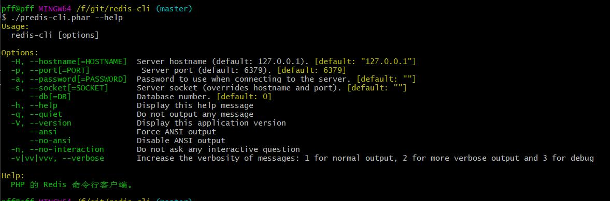
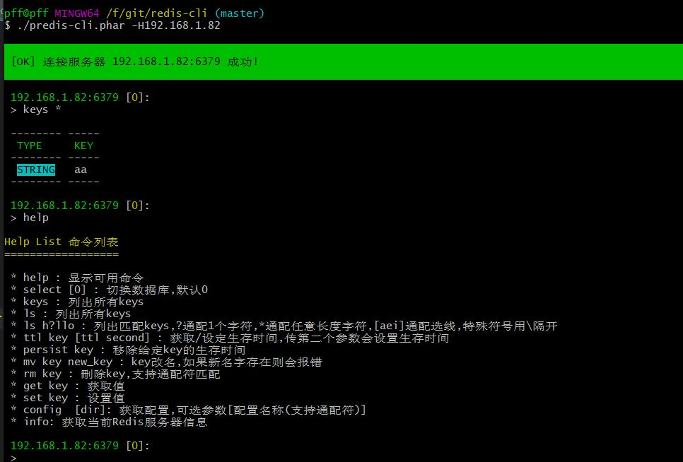

# PHP 写的简单 Redis 客户端

## 是什么



 - 简单操作redis的命令行工具
 - 简单不用每次查文档
 - 查看更直观,之前打算用Electron开发桌面版,但不熟. 所以还是先做一个命令行版本拿来用

## 为什么
 
 - 原因1: 每次做点简单的Redis操作都要翻手册,嫌麻烦. 所以把基本功能做了下简化
 - 原因2: Medis客户端收费了,同事想用发现找个简单操作的没有. 吹牛说自己写一个,于是填坑. 

## 安装方法1(推荐)
  1. 打开 https://github.com/pifeifei/predis-cli/releases/
  2. 下载最新版本的 predis-cli.phar (建议放到 php 的 bin 目录)
  3. php 目录添加到 PATH，不懂的百度
  4. linux : ln -s /path/to/php/bin/predis-cli.phar /usr/bin/predis-cli
  5. window: @"%~dp0php" "%~dp0predis-cli.phar" %* > /path/to/php/predis-cli.bat

## 安装方法2
  1. clone项目代码:  git clone https://github.com/pifeifei/predis-cli.git
  2. 进入文件件:  cd predis-cli
  3. 切换到当前最新版本tag:  git checkout v1.3.2
  4. 使用composer安装依赖包: composer update
  5. ./bin/predis-cli
  6. 这种方法只能在当前目录使用，不推荐

## 使用方法
```shell
# 查看可用参数
predis-cli --help

# 链接
predis-cli -H127.0.0.1 --db=2

# 查看帮助
127.0.0.1 [2]: help 

# 退出
127.0.0.1 [2]: exit

# - 内置 predis 扩展
# - 可以自定义样式,复制config/style.php 到 config/customStyle.php 自己修改相应颜色
# - 可用颜色: [default, black, red, green, yellow, blue, magenta, cyan, white]
```

 ## 特性 (如果有需求或者其他想法可以提issue)
 - (v1.2新特性)输入模仿Linux可以记录命令历史和自动帮助,上下箭头查看历史记录. (小功能但是方便了很多!)
 - 用ls列出当前数据key和对应数据类型
 - select 切换数据库,默认在 0 库
 - ls ?/* 支持通配符搜索key
 - ttl key 查看生存时间
 - ttl key second 设定生存时间
 - persist key 设定生存时间为永久
 - mv name new_name 将key改名
 - rm key 删除key
 - config 获取redis 配置信息
 - get key 获取值和对应信息(主要功能)
 - set key 设置值/新增也可以. 操作流程有待优化,但是已经可用
 
 ## 其他
 
 啰嗦下,这东西毕竟是花了些心思弄出来的.如果大家有什么想法和bug可以提issue. 我会抽时间处理.
 使用上有什么问题也可以随时问.
 
 ## TODO
  - [ ] 打算弄成与 redis-cli 功能类似客户端
  - [x] 用scan代替get * 防止出现查死数据库的情况
  - [x] 完善自动填写功能,如果没有考虑自己加一个
  - [x] 完善上下箭头访问命令历史功能
  - [x] 完善windows命令行可执行文件使用 (有待测试和调整)
  - [x] 把显示颜色样式从项目中抽象出来放到配置文件中,方便用户自己微调


感谢 @wizarot